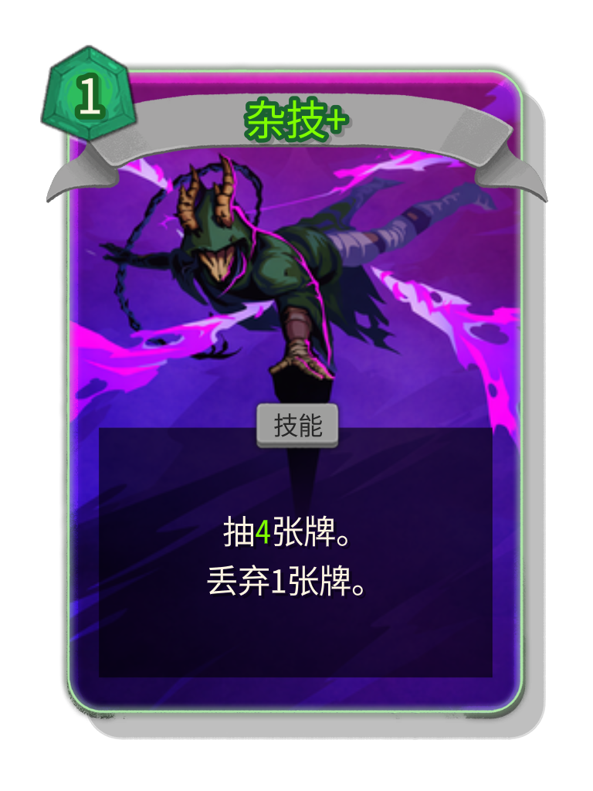

# CardsWithAncientSkin

普通卡的默认外观有时不够有趣，这个项目的目标就是把选定的卡牌显示成 Ancient 风格的卡面。  
This project turns selected cards into an Ancient-style presentation for Slay the Spire 2.

<p align="center">
  
  
  
</p>

## Overview

这个 Mod 只修改卡牌视觉表现，不修改卡牌行为、数值或战斗逻辑。  
This mod only changes card visuals. It does not modify gameplay behavior, card values, or combat logic.

它会读取外部配置和资源，把指定卡牌切换成 Ancient 风格的边框、底图和布局。  
It reads external config and resources, then switches selected cards to an Ancient-style frame, portrait, and layout.

## How It Works

项目通过 Harmony patch 挂到游戏真实的卡牌渲染流程里，而不是单纯离线拼图。  
The project hooks into the game's real card rendering flow through Harmony patches instead of generating cards through an offline mock renderer.

主要文件分工如下：  
The main files are organized like this:

- `ModEntry.cs`：Mod 入口，加载配置并注册 patch。
- `CardVisualHooks.cs`：接入真实 `NCard` 渲染链路。
- `AncientSkinApplicator.cs`：把目标卡切换成 Ancient 风格显示。
- `AncientSkinResources.cs`：读取边框、底图和相关资源。
- `AncientSkinConfig.cs`：读取 `card_config.json`。
- `CiCoreRunnerValidationPatch.cs`：复用现有验证场景，把资源和配置转成批量渲染任务。

- `ModEntry.cs`: mod entry point that loads config and registers patches.
- `CardVisualHooks.cs`: hooks into the real `NCard` render flow.
- `AncientSkinApplicator.cs`: applies the Ancient-style state to supported cards.
- `AncientSkinResources.cs`: loads borders, portraits, and related resources.
- `AncientSkinConfig.cs`: reads `card_config.json`.
- `CiCoreRunnerValidationPatch.cs`: reuses the existing validation scene and turns resources plus config into batch render jobs.

## Repository Layout

这个仓库默认和 `Godot_Card_Render_Setup` 放在同一级目录，因为工程通过相对路径引用游戏程序集。  
This repository is expected to sit next to `Godot_Card_Render_Setup`, because the project references game assemblies through relative paths.

```text
workspace/
  CardsWithAncientSkin/
  Godot_Card_Render_Setup/
```

## Build

下面的命令会生成最新的 Mod DLL。  
The command below builds the latest mod DLL.

```powershell
dotnet build .\CardsWithAncientSkin.csproj -c Debug
```

## Stage To Local Runtime

这个脚本会把 DLL、manifest、配置和资源复制到本地测试 runtime 的 mod 目录。  
This script copies the DLL, manifest, config, and resources into the local test runtime mod folder.

它是部署步骤，不是完整的功能验证。  
It is a staging step, not the full end-to-end validation.

为了避免 STS2 的 mod loader 把配置文件误当成第二个 manifest，脚本会把 `card_config.json` 复制成运行时使用的 `card_config.data`。  
To avoid STS2 treating the config file as a second manifest, the script stages `card_config.json` as `card_config.data` at runtime.

```powershell
powershell -ExecutionPolicy Bypass -File .\stage_mod.ps1 Debug
```

## Test Flow

这个项目带有一套本地验证流程，用来确认 Mod 真的被加载，并且会按当前资源和配置输出卡图。  
This project includes a local validation flow that confirms the mod is really loaded and renders cards from the current resources and config.

验证脚本会依次执行这些步骤：  
The validator script runs these steps:

1. 构建最新 DLL。
2. 调用 `stage_mod.ps1`。
3. 启动本地 STS2 runtime。
4. 读取 `resources/mod_card_portraits_ancient_form`。
5. 读取 `card_config.json`。
6. 为启用的卡生成基础卡和升级卡图片。
7. 把结果输出到 `test_output`。

1. Build the latest DLL.
2. Call `stage_mod.ps1`.
3. Launch the local STS2 runtime.
4. Read `resources/mod_card_portraits_ancient_form`.
5. Read `card_config.json`.
6. Render both base and upgraded versions for enabled cards.
7. Write the outputs into `test_output`.

```powershell
powershell -ExecutionPolicy Bypass -File .\test_output\run_mod_test_validator.ps1
```

## Runtime Layout

运行时 Mod 目录结构如下：  
The runtime mod folder is expected to look like this:

```text
CardsWithAncientSkin/
  CardsWithAncientSkin.json
  CardsWithAncientSkin.dll
  card_config.json
  resources/
```

源码仓库里的配置文件名是 `card_config.json`。  
In the source repository, the config filename is `card_config.json`.

## Configuration

只有显式设置为 `true` 的卡牌才会启用 Ancient 风格。  
Only cards explicitly set to `true` will use the Ancient visual style.

如果没有这个 key，或者值是 `false`，那张卡就继续使用原版显示。  
If a key is missing or set to `false`, that card keeps the default game presentation.

```json
{
  "cards": {
    "acrobatics": true,
    "adrenaline": true
  }
}
```

## Notes

`resources/mod_card_portraits_ancient_form` 里的文件名需要和卡牌 id 对应。  
Filenames inside `resources/mod_card_portraits_ancient_form` should match card id entries.

`test_output` 里的 PNG、TXT 和 LOG 都是生成物，不应该提交到仓库。  
PNG, TXT, and LOG files inside `test_output` are generated outputs and should not be committed.

这个项目还会继续修改，资源、配置和渲染规则都可能继续调整。  
This project is still evolving, and the resources, configuration, and render rules may continue to change.
